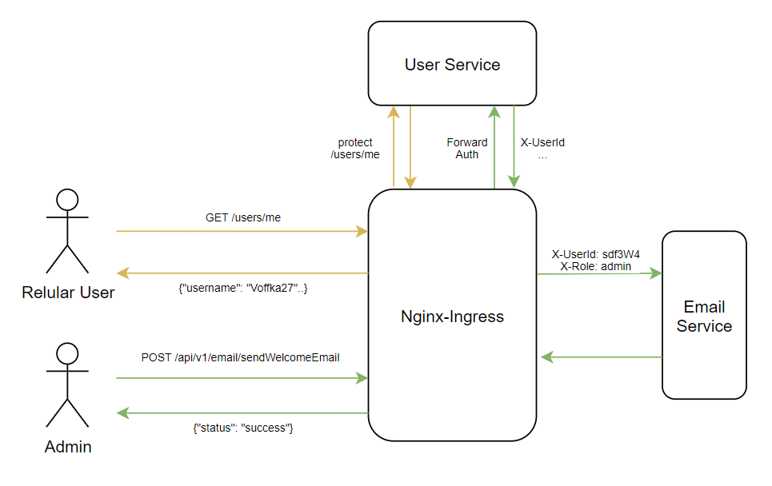

# Домашнее задание №4
# Аутентификация и регистрация пользователей.



Приложение будет располагаться в двух namespace: auth и app. Создаём их.

```
➜  kubectl create namespace auth
namespace/auth created
➜  kubectl create namespace app
namespace/app created
```

Собираем и запускаем сервис работы с пользователями в namespace/auth. Этот сервис содержит в себе CRUD для пользователей, доступный только администраторам, а также функционал по регистрации, восстановлению пароля, аутентификации и авторизации.

```bash
➜  kubectl config set-context --current --namespace=auth
➜  helm install mngdb bitnami/mongodb -f mngdb-values.yaml
➜  cd user
➜  kubectl apply -f .
configmap/kia-user-config created
secret/kia-user-secret created
deployment.apps/kia-user-deployment created
ingress.networking.k8s.io/kia-user-ingress created
service/kia-user-service created
```

В namespace/app на данный момент будет только сервис email, отвечающий за отправку писем.
```bash
➜  kubectl config set-context --current --namespace=app
➜  cd ../email
➜  kubectl apply -f .
configmap/kia-email-config created
secret/kia-email-secret created
deployment.apps/kia-email-deployment created
ingress.networking.k8s.io/kia-email-ingress created
service/kia-email-service created
```

Запускаем тесты с помощью newman.

```bash
➜  newman run otusArch_KIA_hw4.postman_collection.json
```