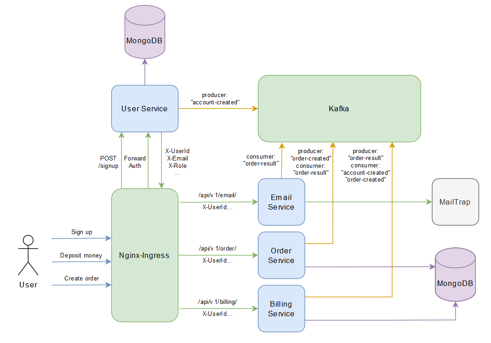

# Домашнее задание №5
# Stream processing.

### Схема взаимодействия сервисов.



Пользователь может создать заказ. У заказа есть параметр - цена заказа.
Заказ происходит в 2 этапа:
1) сначала снимаем деньги с пользователя с помощью сервиса биллинга
2) отсылаем пользователю сообщение на почту с результатами оформления заказа. Если биллинг подтвердил платеж, должно отослаться письмо счастья. Если нет, то письмо горя.

### Инструкция по установке и запуску сервисов.

Приложение будет располагаться в трёх namespace: auth, app и broker. Создаём их.

```
➜  kubectl create namespace auth
namespace/auth created
➜  kubectl create namespace app
namespace/app created
➜  kubectl create namespace broker
namespace/broker created
```

Переключаемся в пространство broker и ставим там сборник Kafka от confluent при помощи helm.

```bash
➜  kubectl config set-context --current --namespace=broker
➜  helm install cp confluentinc/cp-helm-charts -f cp_values.yaml
```

Собираем и запускаем сервис работы с пользователями в namespace/auth. Этот сервис содержит в себе CRUD для пользователей, доступный только администраторам, а также функционал по регистрации, восстановлению пароля, аутентификации и авторизации.

```bash
➜  kubectl config set-context --current --namespace=auth
➜  helm install mngdb-auth bitnami/mongodb -f mngdb-auth-values.yaml
➜  cd user
➜  kubectl apply -f .
```

В namespace/app будут обитать все остальные сервисы: email, order, billing. Для удобства все манифесты лежат в папке all-app-in-one.
```bash
➜  kubectl config set-context --current --namespace=app
➜  cd ../all-app-in-one
➜  kubectl apply -f .
```

### Тестирование работоспособности функционала.

Запускаем тесты с помощью newman.

```bash
➜  cd ../
➜  newman run otusArch_KIA_hw5.postman_collection.json
```
